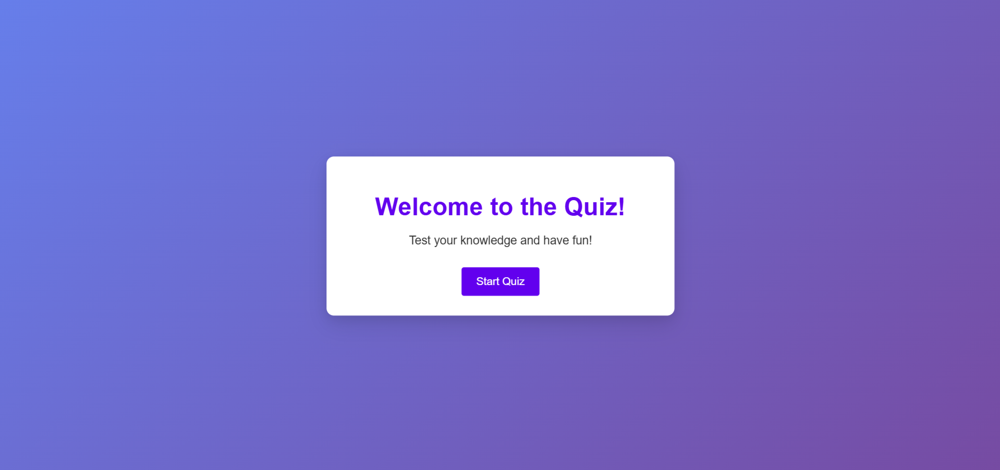
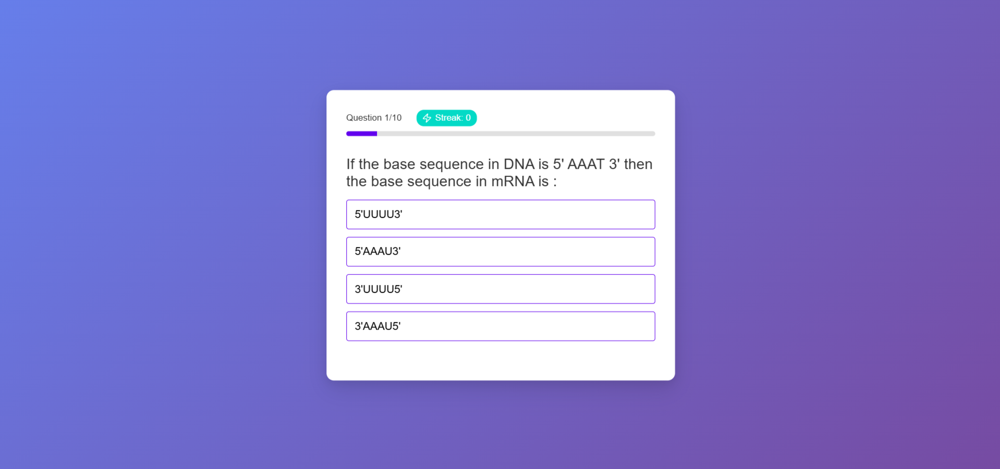
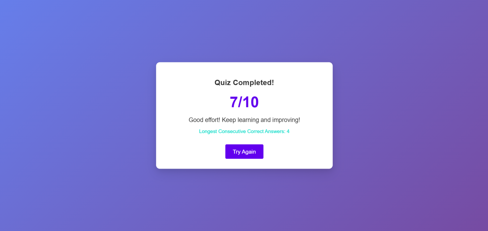

# 🧬 Genetics Quiz Application

## 📝 Project Overview
An interactive web-based quiz application focused on Genetics and Molecular Inheritance, featuring dynamic question loading, real-time scoring, and streak tracking.

## 🚀 Features
- 10 dynamic quiz questions from API
- Real-time score tracking
- Streak calculation
- Animated transitions
- Responsive design

## 📸 Screenshots

### Start Screen


### Quiz Interface


### Result Screen


## 🎥 Video Walkthrough
[Watch the Full App Walkthrough](https://www.youtube.com/watch?v=J8ksiGReJ2w)

## 🔧 Setup Instructions

### Prerequisites
- Node.js (v14+)
- npm or Yarn

### Installation Steps
1. Clone the repository
```bash
git clone https://github.com/HarshadSanjayKarale/Testline.git
cd Testline
```

2. Install dependencies
```bash
npm install
```

3. Start development server
```bash
npm run dev
```

## 🛠 Tech Stack
- React
- Vite
- Framer Motion
- Lucide React Icons


## 🤝 Contributing
1. Fork the repository
2. Create feature branch
3. Commit changes
4. Push to branch
5. Create pull request
